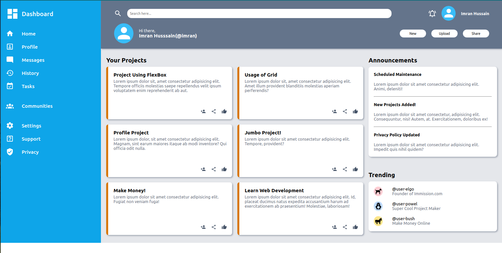

# Admin Dashboard

## [Click Here](https://full-stackninja.github.io/admin-dashboard/) for Live Preview
## Screen Shot of the Page

## Project Details

-    This project is the part of the Full Stack Web Development Course Offered by [The Odin project.](https://theodinproject.com)
-    This project could be done by other techniques like Flex Box but the main focus was to learn and implement Grid Layout technique.
-    The page is responsive to browser variations and dimensions.
-    All the SVG icons are taken from [Pictogrammers](https://pictogrammers.com/library/mdi/) with custom color modifications made myself.
-    Custom colors ideas used in the page layout are taken from color palettes on [Tailwind.](https://tailwindcss.com/docs/customizing-colors)

## Technologies Used

